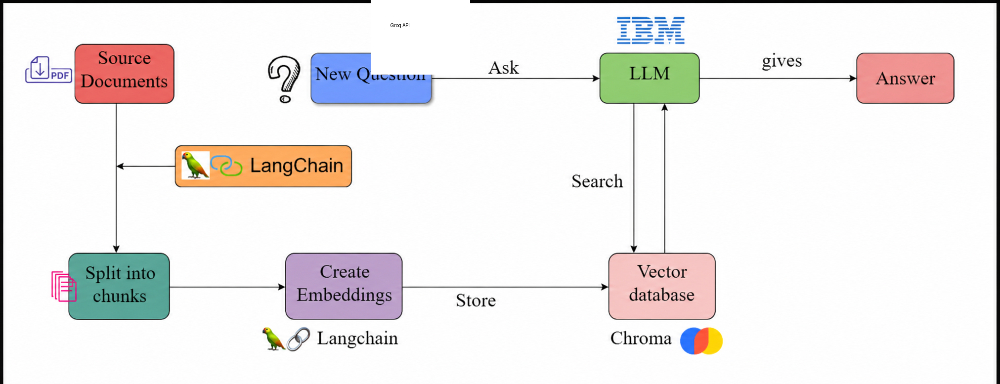

# 📄 QueryVault — PDF Question Answering Bot

> Ask questions about any PDF document and get intelligent, context-aware answers powered by **Groq API (Llama-3.3 70B Instruct)**, **LangChain RAG**, and an **ephemeral ChromaDB**.


🚀 **Live Demo:** [Try QueryVault on Hugging Face Spaces!](https://huggingface.co/spaces/Padmini1/queryvault)

---

## 🧠 How It Works

QueryVault implements a full **Retrieval-Augmented Generation (RAG)** pipeline:




### ASCII Representation:
```
PDF Upload
    │
    ▼
PyPDFLoader  ──── loads raw text from all pages
    │
    ▼
RecursiveCharacterTextSplitter  ──── splits into ~1000-char chunks
    │
    ▼
HuggingFace Local Embeddings  ──── converts each chunk to a vector
    │
    ▼
ChromaDB  ──── stores and indexes all vectors in-memory (per PDF)
    │
    ▼
User Question ──► similarity search ──► top-3 relevant chunks retrieved
    │
    ▼
Llama-3.3 70B Instruct (ChatGroq)  ──── reads context + question → generates answer
    │
    ▼
Gradio UI  ──── displays the answer to the user
```

---

## 🗂️ Project Structure

```
queryvault/
│
├── app.py                  # Gradio web interface — run this to start the app
│
├── src/
│   ├── __init__.py
│   └── qabot.py            # Full RAG pipeline: loader → splitter → embedder → retriever → LLM → chain
│
├── docs/
│   └── DECISION_STRUCTURE.md   # Full design decisions explained in plain English
│
├── requirements.txt        # All Python dependencies
├── .env.example            # Credential template (rename to .env and fill in)
├── .gitignore
└── README.md
```

---

## ⚙️ Setup & Installation

### 1. Clone the repository

```bash
git clone https://github.com/YOUR_USERNAME/queryvault.git
cd queryvault
```

### 2. Create a virtual environment

```bash
python -m venv venv

# Windows
venv\Scripts\activate

# macOS / Linux
source venv/bin/activate
```

### 3. Install dependencies

```bash
pip install -r requirements.txt
```

### 4. Add your Groq API credentials

To run this app locally, you need a free API key from Groq:

1. Create a file named `.env` in the root folder.
2. Open the `.env` file and add the following lines:

```env
GROQ_API_KEY=your_groq_api_key
```

> **How to get a free key:**
> 1. Sign up at [console.groq.com](https://console.groq.com/)
> 2. Go to API Keys and generate a new key

### 5. Run the app

```bash
python app.py
```

Open `http://127.0.0.1:7860` in your browser.

---

## 🖥️ Usage

1. Click **Upload PDF** and select any PDF document.
2. Type your question in the **Your Question** box.
3. Click **Get Answer**.
4. The bot retrieves relevant sections from your document and generates a clear answer.

---

## 🌍 Sharing & Deployment

### Temporary Public Link (The Easiest Way)
Because this app uses Gradio, you don't even need to deploy it to share it with your friends or recruiters! 
When you run `python app.py` on your computer, Gradio automatically generates a temporary public URL (e.g., `https://1234abcd.gradio.live`). 
- Simply copy that `gradio.live` link from your terminal and send it to anyone!
- *Note: This link only works while the terminal is actively running on your PC.*

### Permanent Free Deployment (Hugging Face Spaces)
If you want the app to be available 24/7 without keeping your computer on, you can deploy it for free using Hugging Face:
1. Go to [Hugging Face Spaces](https://huggingface.co/spaces) and create a free account.
2. Click **Create new Space**.
3. Enter a Space name, choose **Gradio** as the Space SDK, and click Create.
4. In the Settings tab of your new Space, go to **Variables and secrets**. Add your `.env` variable as a **Secret** (`GROQ_API_KEY`).
5. Upload all the files from this repository (except `venv` and `.env`) directly into the "Files" tab of your Space.
6. The Space will automatically build and launch your app permanently!

---

## 🧩 Component Decisions

| Component | Choice | Why |
|---|---|---|
| Document Loader | `PyPDFLoader` | Handles multi-page PDFs reliably |
| Text Splitter | `RecursiveCharacterTextSplitter` | Preserves context at chunk boundaries |
| Embedding Model | HuggingFace `all-MiniLM-L6-v2` | Optimized for semantic similarity; runs locally for free |
| Vector Database | ChromaDB (In-Memory) | Lightweight, completely isolates each PDF upload |
| LLM | Llama-3.3 70B Instruct | State-of-the-art instruction-following; powerful reasoning |
| Orchestration | LangChain | Clean pipeline abstraction, easy to extend |
| UI | Gradio | Zero-config web app, file upload built-in |

---

## 📊 Capabilities & Performance

| Feature | Details |
|---|---|
| **Model** | Llama-3.3 70B (State-of-the-art open source model) |
| **Response Time** | Typically < 3 seconds (Powered by Groq LPUs) |
| **Context Window** | Retrieves top 10 most relevant chunks per query |
| **Document Size** | Tested with PDFs up to 50+ pages seamlessly |
| **Accuracy** | High context-awareness; strictly answers based on provided document |

---

## 🔮 Future Enhancements

- [ ] Support for DOCX and TXT file formats
- [ ] Multi-document querying
- [ ] Conversation memory (multi-turn chat)
- [ ] Voice input / output (accessibility)
- [ ] Multilingual support
- [ ] Cloud deployment (HuggingFace Spaces / AWS)
- [ ] User feedback loop for continuous improvement

---

## 📚 Tech Stack

- [LangChain](https://docs.langchain.com) — RAG pipeline orchestration
- [Groq](https://groq.com/) — Lightning-fast LLM inference
- [ChromaDB](https://www.trychroma.com) — Vector database
- [Gradio](https://www.gradio.app) — Web UI
- [PyPDF](https://pypdf.readthedocs.io) — PDF parsing

---

## 📄 License

MIT License — see [LICENSE](LICENSE) for details.
